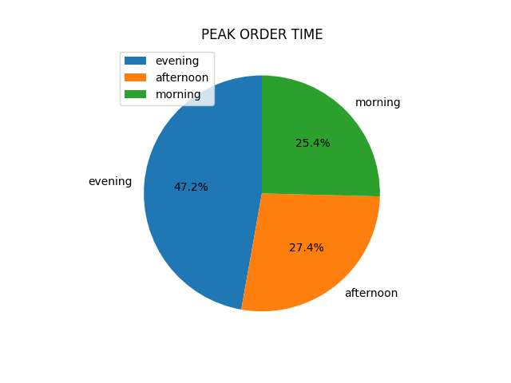
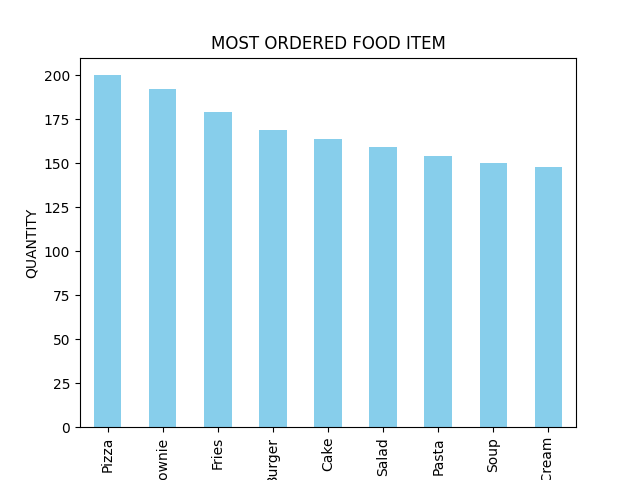
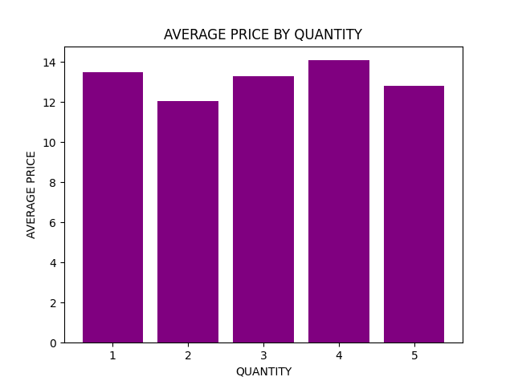
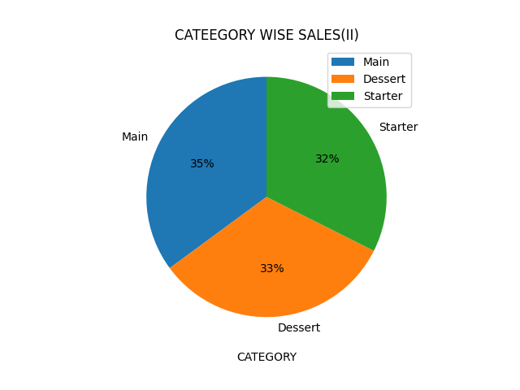

# **Restaurant Orders Data Analysis**

### **Project Overview**

This project analyzes restaurant order data to understand sales patterns, popular food items,

and customer ordering behavior.

### **Dataset**

The dataset used in this project contains restaurant order details such as order id, food item, customer name,

category, quantity, price and order time.

###### **File Used:**

* restaurant\_orders.csv

### **Tools Used :**

* Python
* Pandas
* Matplotlib

### **Analysis Performed :** 

The following analysis was performed on the dataset.

* Average price based on quantity
* Category wise sales(I)
* Category wise sales(II)
* Most ordered food item
* Peak order time

### **Visualizations :** 

The project generates charts using Matplotlib.

All charts are saved inside the **output** folder.

##### **Charts included :**

* Average price based on quantity
* Category wise sales(I)
* Category wise sales(II)
* Most ordered food item
* Peak order time

### **Project Structure :** 

restaurant-orders-python-project

|

|-- restaurant\_orders.csv(Dataset)

|

|--analysis.py(Python code for analysis)

|

|--output(Charts generated from analysis)

|

|--README.md(Project description)

### **Visualizations**

###### **Peak Order Time**

###### **Insights:** 

###### **Most Ordered Food Item**

###### **Insights:**

###### **Category Wise Sales(1)**
_chart.png)
###### **Insights:**

###### **Average Price**

###### **Insights:**

###### **Category Wise Sales(2)**

###### **Insights:**  Main,Starter and Dessert categories have equal sales, showing balanced customer preferences.

### **Conclusion** 

This analysis helps understand customer preferences and restaurant sales trends.

The insights can help restaurants improve menu planning and sales strategies. 

### &nbsp;

##### 

